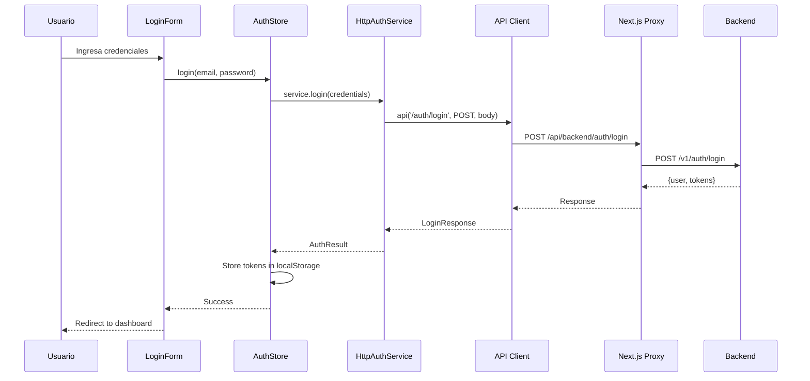
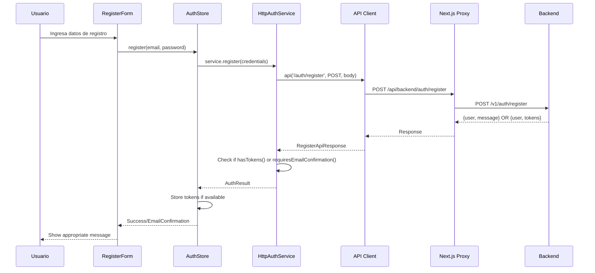
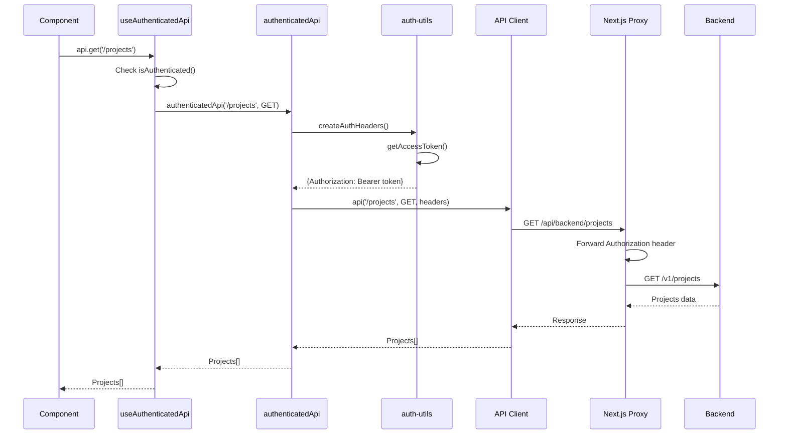

# Guía de Comunicación Frontend-Backend - Flowmatic

Esta guía documenta **completamente** cómo el frontend de Flowmatic se comunica con el backend para obtener usuarios y gestionar la autenticación. Incluye todos los detalles técnicos necesarios para implementar un servicio similar.

## 📋 Índice

1. [Arquitectura General](#arquitectura-general)
2. [Configuración Base](#configuración-base)
3. [Sistema de Autenticación](#sistema-de-autenticación)
4. [Gestión de Usuarios](#gestión-de-usuarios)
5. [Flujo de Comunicación](#flujo-de-comunicación)
6. [Manejo de Errores](#manejo-de-errores)
7. [Almacenamiento de Datos](#almacenamiento-de-datos)
8. [Implementación Práctica](#implementación-práctica)
9. [Ejemplos de Código](#ejemplos-de-código)
10. [Troubleshooting](#troubleshooting)

---

## 🏗️ Arquitectura General

### Patrón de Diseño

El sistema sigue los **principios SOLID** y utiliza:

- **Interface Segregation**: Interfaces específicas para cada responsabilidad
- **Dependency Inversion**: Dependencias a través de interfaces, no implementaciones
- **Single Responsibility**: Cada clase tiene una responsabilidad específica
- **Open/Closed**: Extensible sin modificar código existente

### Capas del Sistema

```
┌─────────────────────────────────────┐
│           UI Components             │
│  (LoginForm, RegisterForm, etc.)   │
└─────────────────┬───────────────────┘
                  │
┌─────────────────▼───────────────────┐
│         Auth Store (Context)        │
│    (React Context + useReducer)     │
└─────────────────┬───────────────────┘
                  │
┌─────────────────▼───────────────────┐
│        Auth Service Interface       │
│         (AuthService)               │
└─────────────────┬───────────────────┘
                  │
┌─────────────────▼───────────────────┐
│      HTTP Auth Service              │
│    (HttpAuthService)                │
└─────────────────┬───────────────────┘
                  │
┌─────────────────▼───────────────────┐
│         API Client                   │
│        (api.ts)                      │
└─────────────────┬───────────────────┘
                  │
┌─────────────────▼───────────────────┐
│      Next.js API Proxy              │
│   (/api/backend/[...path]/route.ts)  │
└─────────────────┬───────────────────┘
                  │
┌─────────────────▼───────────────────┐
│           Backend API                │
│        (Supabase/Node.js)           │
└─────────────────────────────────────┘
```

---

## ⚙️ Configuración Base

### Variables de Entorno

```bash
# Frontend (.env.local)
NEXT_PUBLIC_API_BASE_URL=http://localhost:3000
NEXT_PUBLIC_API_VERSION=v1

# Para desarrollo con ngrok
NEXT_PUBLIC_API_BASE_URL=https://abc123.ngrok.io
```

### Configuración de URLs

```typescript
// src/lib/config.ts
export const config = {
  api: {
    backendUrl: process.env.NEXT_PUBLIC_API_BASE_URL || 'http://localhost:3000',
    version: process.env.NEXT_PUBLIC_API_VERSION || 'v1',
    
    get baseUrl() {
      if (typeof window !== 'undefined') {
        // Cliente: usar proxy para evitar warning de ngrok
        return '/api/backend';
      }
      // Servidor: usar URL directa
      return this.backendUrl;
    },
    
    get apiUrl() {
      return `${this.baseUrl}/${this.version}`;
    }
  },
  auth: {
    accessTokenKey: 'flowmatic_access_token',
    refreshTokenKey: 'flowmatic_refresh_token',
    userKey: 'flowmatic_user'
  }
};
```

### Proxy de Next.js

```typescript
// src/app/api/backend/[...path]/route.ts
export async function GET(request: NextRequest, context: { params: Promise<{ path: string[] }> }) {
  const backendBaseUrl = config.api.backendUrl;
  const params = await context.params;
  const pathSegments = params?.path ?? [];
  const joinedPath = pathSegments.join('/');
  const targetUrl = `${backendBaseUrl}/${joinedPath}${request.nextUrl.search}`;

  // Headers permitidos
  const allowedHeaders = ['authorization', 'accept', 'content-type', 'accept-language'];
  const forwardedHeaders = new Headers();
  
  for (const [key, value] of request.headers.entries()) {
    if (allowedHeaders.includes(key.toLowerCase())) {
      forwardedHeaders.set(key, value);
    }
  }

  // Header para ngrok
  if (backendBaseUrl.includes('ngrok')) {
    forwardedHeaders.set('ngrok-skip-browser-warning', 'true');
  }

  const response = await fetch(targetUrl, {
    method: 'GET',
    headers: forwardedHeaders,
    cache: 'no-store'
  });

  return new NextResponse(await response.arrayBuffer(), {
    status: response.status,
    headers: { 'content-type': response.headers.get('content-type') || 'application/json' }
  });
}
```

---

## 🔐 Sistema de Autenticación

### Interfaces Principales

```typescript
// src/lib/auth-service.ts
export interface AuthService {
  login(credentials: LoginRequest): Promise<AuthResult>;
  register(credentials: RegisterRequest): Promise<AuthResult>;
  refreshTokens(refreshToken: string): Promise<AuthTokens>;
  logout(): Promise<void>;
  getCurrentUser(): Promise<AuthUser | null>;
  isAuthenticated(): Promise<boolean>;
}

export interface AuthResult {
  user: AuthUser;
  tokens?: AuthTokens;
  requiresEmailConfirmation?: boolean;
  message?: string;
}

export interface AuthUser {
  id: string;
  email: string;
  app_metadata: Record<string, unknown>;
  user_metadata: Record<string, unknown>;
  aud: string;
}

export interface AuthTokens {
  accessToken: string;
  refreshToken: string;
  expiresIn: number;
  tokenType: 'bearer';
}
```

### Tipos de Request/Response

```typescript
// src/lib/auth-types.ts
export interface LoginRequest {
  email: string;
  password: string;
}

export interface RegisterRequest {
  email: string;
  password: string;
}

export interface LoginResponse {
  access_token: string;
  refresh_token: string;
  expires_in: number;
  token_type: "bearer";
  user: User;
}

export interface RegisterResponse {
  message: string;
  user: User;
}

export interface RegisterWithTokensResponse extends RegisterResponse, AuthTokens {}

// Union type para manejar ambas variantes
export type RegisterApiResponse = RegisterResponse | RegisterWithTokensResponse;
```

### Implementación HTTP

```typescript
// src/lib/http-auth-service.ts
export class HttpAuthService implements AuthService {
  private readonly basePath = '/auth';

  async login(credentials: LoginRequest): Promise<AuthResult> {
    try {
      const response = await api<LoginResponse>(`${this.basePath}/login`, {
        method: 'POST',
        body: JSON.stringify(credentials)
      });

      return {
        user: this.mapUser(response.user),
        tokens: this.mapTokens(response)
      };
    } catch (error) {
      throw this.mapError(error);
    }
  }

  async register(credentials: RegisterRequest): Promise<AuthResult> {
    try {
      const response = await api<RegisterApiResponse>(`${this.basePath}/register`, {
        method: 'POST',
        body: JSON.stringify(credentials)
      });

      const result: AuthResult = {
        user: this.mapUser(response.user),
        message: response.message
      };

      // Verificar si incluye tokens o requiere confirmación
      if (hasTokens(response)) {
        result.tokens = this.mapTokens(response);
      } else if (requiresEmailConfirmation(response)) {
        result.requiresEmailConfirmation = true;
      }

      return result;
    } catch (error) {
      throw this.mapError(error);
    }
  }

  // Métodos privados de mapeo
  private mapUser(user: any): AuthUser {
    return {
      id: user.id,
      email: user.email,
      app_metadata: user.app_metadata || {},
      user_metadata: user.user_metadata || {},
      aud: user.aud
    };
  }

  private mapTokens(response: any): AuthTokens {
    return {
      accessToken: response.access_token,
      refreshToken: response.refresh_token,
      expiresIn: response.expires_in,
      tokenType: response.token_type || 'bearer'
    };
  }

  private mapError(error: unknown): AuthError {
    if (error instanceof ApiException) {
      switch (error.statusCode) {
        case 400: return new ValidationError(error.message, 'request');
        case 401: return new UnauthorizedError(error.message);
        case 409: return new ConflictError(error.message);
        default: return new AuthError(error.message, 'API_ERROR', error.statusCode);
      }
    }
    // ... manejo de otros errores
  }
}
```

---

## 👥 Gestión de Usuarios

### Endpoints de Usuario

```typescript
// Endpoints implementados
POST /v1/auth/login          // Login de usuario
POST /v1/auth/register       // Registro de usuario
GET  /v1/user/me            // Obtener usuario actual (pendiente)
POST /v1/auth/refresh       // Refresh tokens (pendiente)

// Endpoints futuros
GET    /v1/user/profile     // Perfil de usuario
PUT    /v1/user/profile     // Actualizar perfil
GET    /v1/user/settings    // Configuraciones
PATCH  /v1/user/settings    // Actualizar configuraciones
DELETE /v1/user/account     // Eliminar cuenta
```

### Cliente API Autenticado

```typescript
// src/lib/authenticated-api.ts
export async function authenticatedApi<T>(
  path: string, 
  init?: RequestInit
): Promise<T> {
  if (!isAuthenticated()) {
    throw new Error('Authentication required');
  }

  const authHeaders = createAuthHeaders();
  const headers = {
    ...authHeaders,
    ...(init?.headers || {})
  };

  return api<T>(path, {
    ...init,
    headers
  });
}

export const authApi = {
  async get<T>(path: string, headers?: Record<string, string>): Promise<T> {
    return authenticatedApi<T>(path, { method: 'GET', headers });
  },
  
  async post<T>(path: string, body?: any, headers?: Record<string, string>): Promise<T> {
    return authenticatedApi<T>(path, { 
      method: 'POST', 
      body: typeof body === 'string' ? body : JSON.stringify(body),
      headers 
    });
  },
  
  // ... otros métodos HTTP
};
```

### Hook para API Autenticada

```typescript
// src/lib/use-authenticated-api.ts
export function useAuthenticatedApi() {
  const { state } = useAuth();

  const authenticatedCall = useCallback(
    async <T>(
      apiCall: () => Promise<T>,
      options: { redirectOnAuth?: boolean; redirectPath?: string } = {}
    ): Promise<T> => {
      const { redirectOnAuth = true, redirectPath = '/login' } = options;

      if (!state.isAuthenticated || !isAuthenticated()) {
        if (redirectOnAuth) {
          window.location.href = redirectPath;
        }
        throw new Error('Authentication required');
      }

      return apiCall();
    },
    [state.isAuthenticated]
  );

  return {
    api: {
      get: (path: string, headers?: Record<string, string>) => 
        authenticatedCall(() => authApi.get(path, headers)),
      post: (path: string, body?: any, headers?: Record<string, string>) => 
        authenticatedCall(() => authApi.post(path, body, headers)),
      // ... otros métodos
    },
    isAuthenticated: state.isAuthenticated
  };
}
```

---

## 🔄 Flujo de Comunicación

### 1. Flujo de Login



### 2. Flujo de Registro



### 3. Flujo de Request Autenticado



---

## 🚨 Manejo de Errores

### Jerarquía de Errores

```typescript
// src/lib/auth-service.ts
export class AuthError extends Error {
  constructor(
    message: string,
    public code: string,
    public statusCode?: number
  ) {
    super(message);
    this.name = 'AuthError';
  }
}

export class NetworkError extends AuthError {
  constructor(message: string) {
    super(message, 'NETWORK_ERROR');
  }
}

export class ValidationError extends AuthError {
  constructor(message: string, public field?: string) {
    super(message, 'VALIDATION_ERROR', 400);
  }
}

export class UnauthorizedError extends AuthError {
  constructor(message: string = 'Invalid credentials') {
    super(message, 'UNAUTHORIZED', 401);
  }
}

export class ConflictError extends AuthError {
  constructor(message: string = 'Resource already exists') {
    super(message, 'CONFLICT', 409);
  }
}
```

### Mapeo de Errores HTTP

```typescript
// src/lib/http-auth-service.ts
private mapError(error: unknown): AuthError {
  if (error instanceof ApiException) {
    switch (error.statusCode) {
      case 400:
        return new ValidationError(error.message, 'request');
      case 401:
        return new UnauthorizedError(error.message);
      case 409:
        return new ConflictError(error.message);
      default:
        return new AuthError(error.message, 'API_ERROR', error.statusCode);
    }
  }

  if (error instanceof Error) {
    if (error.message.includes('fetch') || error.message.includes('network')) {
      return new NetworkError(error.message);
    }
    return new AuthError(error.message, 'UNKNOWN_ERROR');
  }

  return new AuthError('An unexpected error occurred', 'UNKNOWN_ERROR');
}
```

### Manejo en Componentes

```typescript
// Ejemplo de uso en componente
export default function LoginForm() {
  const { login } = useAuth();
  const [error, setError] = useState<string | null>(null);

  const handleSubmit = async (credentials: LoginRequest) => {
    try {
      setError(null);
      await login(credentials.email, credentials.password);
      // Redirigir al dashboard
    } catch (error) {
      if (error instanceof ValidationError) {
        setError(`Datos inválidos: ${error.message}`);
      } else if (error instanceof UnauthorizedError) {
        setError('Credenciales incorrectas');
      } else if (error instanceof NetworkError) {
        setError('Error de conexión. Intenta nuevamente.');
      } else {
        setError('Error inesperado. Intenta nuevamente.');
      }
    }
  };

  return (
    <form onSubmit={handleSubmit}>
      {/* Form fields */}
      {error && <div className="error">{error}</div>}
    </form>
  );
}
```

---

## 💾 Almacenamiento de Datos

### LocalStorage Keys

```typescript
// src/lib/config.ts
export const config = {
  auth: {
    accessTokenKey: 'flowmatic_access_token',    // JWT access token
    refreshTokenKey: 'flowmatic_refresh_token', // Refresh token
    userKey: 'flowmatic_user'                   // User data serialized
  }
};
```

### Funciones de Utilidad

```typescript
// src/lib/auth-utils.ts
export function getAccessToken(): string | null {
  if (typeof window === 'undefined') return null;
  return localStorage.getItem(config.auth.accessTokenKey);
}

export function getRefreshToken(): string | null {
  if (typeof window === 'undefined') return null;
  return localStorage.getItem(config.auth.refreshTokenKey);
}

export function getStoredUser(): Record<string, unknown> | null {
  if (typeof window === 'undefined') return null;
  const userStr = localStorage.getItem(config.auth.userKey);
  if (!userStr) return null;
  try {
    return JSON.parse(userStr) as Record<string, unknown>;
  } catch {
    return null;
  }
}

export function isAuthenticated(): boolean {
  const token = getAccessToken();
  return typeof token === 'string' && token.trim().length > 0;
}

export function clearAuthData(): void {
  if (typeof window === 'undefined') return;
  localStorage.removeItem(config.auth.accessTokenKey);
  localStorage.removeItem(config.auth.refreshTokenKey);
  localStorage.removeItem(config.auth.userKey);
}

export function createAuthHeaders(additionalHeaders: Record<string, string> = {}): Record<string, string> {
  const token = getAccessToken();
  if (!token) {
    throw new Error('No access token available');
  }

  return {
    'Authorization': `Bearer ${token}`,
    'Content-Type': 'application/json',
    'Accept': 'application/json',
    ...additionalHeaders
  };
}
```

### Validación de Tokens

```typescript
// src/lib/auth-utils.ts
export function isTokenExpired(token: string): boolean {
  try {
    const payload = JSON.parse(atob(token.split('.')[1]));
    const now = Math.floor(Date.now() / 1000);
    return payload.exp < now;
  } catch {
    return true;
  }
}

export function getTokenExpiration(token: string): Date | null {
  try {
    const payload = JSON.parse(atob(token.split('.')[1]));
    return new Date(payload.exp * 1000);
  } catch {
    return null;
  }
}

export function needsTokenRefresh(token: string): boolean {
  const timeUntilExpiration = getTimeUntilExpiration(token);
  return timeUntilExpiration < 300; // 5 minutes
}
```

---

## 🛠️ Implementación Práctica

### 1. Configuración Inicial

```typescript
// src/lib/config.ts
export const config = {
  api: {
    backendUrl: process.env.NEXT_PUBLIC_API_BASE_URL || 'http://localhost:3000',
    version: process.env.NEXT_PUBLIC_API_VERSION || 'v1',
    
    get baseUrl() {
      if (typeof window !== 'undefined') {
        return '/api/backend';
      }
      return this.backendUrl;
    },
    
    get apiUrl() {
      return `${this.baseUrl}/${this.version}`;
    }
  },
  auth: {
    accessTokenKey: 'flowmatic_access_token',
    refreshTokenKey: 'flowmatic_refresh_token',
    userKey: 'flowmatic_user'
  }
};
```

### 2. Cliente API Base

```typescript
// src/lib/api.ts
export async function api<T>(path: string, init?: RequestInit): Promise<T> {
  const url = `${config.api.apiUrl}${path}`;

  const defaultHeaders: Record<string, string> = {
    'Content-Type': 'application/json',
    'Accept': 'application/json',
  };

  // Header para ngrok
  if (config.api.backendUrl && config.api.backendUrl.includes('ngrok')) {
    defaultHeaders['ngrok-skip-browser-warning'] = 'true';
  }

  const response = await fetch(url, {
    ...init,
    headers: {
      ...defaultHeaders,
      ...(init?.headers || {}),
    },
    cache: 'no-store'
  });

  if (!response.ok) {
    let errorData: ApiError;
    try {
      errorData = await response.json();
    } catch {
      errorData = {
        statusCode: response.status,
        message: `HTTP ${response.status}: ${response.statusText}`,
        path: path,
        method: init?.method || 'GET',
        timestamp: new Date().toISOString(),
        requestId: 'unknown'
      };
    }

    throw new ApiException(
      errorData.statusCode,
      errorData.message,
      errorData.path,
      errorData.method,
      errorData.timestamp,
      errorData.requestId
    );
  }

  if (response.status === 204 || response.headers.get('content-length') === '0') {
    return undefined as T;
  }

  const contentType = response.headers.get('content-type');
  if (contentType && contentType.includes('application/json')) {
    return response.json() as Promise<T>;
  }

  throw new Error(`Unexpected content-type from API: ${contentType || 'none'}`);
}
```

### 3. Store de Autenticación

```typescript
// src/lib/auth-store.tsx
interface AuthState {
  user: AuthUser | null;
  isAuthenticated: boolean;
  isLoading: boolean;
  error: string | null;
  tokens: AuthTokens | null;
}

type AuthAction = 
  | { type: 'AUTH_START' }
  | { type: 'AUTH_SUCCESS'; payload: { user: AuthUser; tokens?: AuthTokens } }
  | { type: 'AUTH_ERROR'; payload: string }
  | { type: 'AUTH_LOGOUT' }
  | { type: 'AUTH_LOADING'; payload: boolean };

function authReducer(state: AuthState, action: AuthAction): AuthState {
  switch (action.type) {
    case 'AUTH_START':
      return { ...state, isLoading: true, error: null };
    case 'AUTH_SUCCESS':
      return {
        ...state,
        user: action.payload.user,
        tokens: action.payload.tokens || null,
        isAuthenticated: true,
        isLoading: false,
        error: null
      };
    case 'AUTH_ERROR':
      return {
        ...state,
        error: action.payload,
        isLoading: false,
        isAuthenticated: false,
        user: null,
        tokens: null
      };
    case 'AUTH_LOGOUT':
      return {
        ...state,
        user: null,
        tokens: null,
        isAuthenticated: false,
        isLoading: false,
        error: null
      };
    case 'AUTH_LOADING':
      return { ...state, isLoading: action.payload };
    default:
      return state;
  }
}

export function AuthProvider({ children, service = authService }: AuthProviderProps) {
  const [state, dispatch] = useReducer(authReducer, initialState);

  // Inicialización en mount
  useEffect(() => {
    const initializeAuth = async () => {
      try {
        dispatch({ type: 'AUTH_LOADING', payload: true });
        
        const token = getAccessToken();
        if (token) {
          const storedUser = getStoredUser();
          if (storedUser) {
            const user: AuthUser = {
              id: String(storedUser.id),
              email: storedUser.email as string,
              app_metadata: (storedUser.app_metadata as Record<string, unknown>) || {},
              user_metadata: (storedUser.user_metadata as Record<string, unknown>) || {},
              aud: String(storedUser.aud || 'authenticated'),
            };
            
            dispatch({
              type: 'AUTH_SUCCESS',
              payload: { user }
            });
          } else {
            dispatch({ type: 'AUTH_LOGOUT' });
          }
        } else {
          dispatch({ type: 'AUTH_LOADING', payload: false });
        }
      } catch (error) {
        console.warn('Auth initialization failed:', error);
        dispatch({ type: 'AUTH_LOGOUT' });
      } finally {
        dispatch({ type: 'AUTH_LOADING', payload: false });
      }
    };

    initializeAuth();
  }, [service]);

  const login = async (email: string, password: string) => {
    try {
      dispatch({ type: 'AUTH_START' });
      
      const result = await service.login({ email, password });
      
      if (result.tokens) {
        const anyTokens = result.tokens as unknown as Partial<AuthTokens> & Partial<AuthTokensApiShape>;
        const access = anyTokens.accessToken ?? anyTokens.access_token;
        const refresh = anyTokens.refreshToken ?? anyTokens.refresh_token;
        
        if (access) localStorage.setItem('flowmatic_access_token', access);
        if (refresh) localStorage.setItem('flowmatic_refresh_token', refresh);
        localStorage.setItem('flowmatic_user', JSON.stringify(result.user));
      }
      
      dispatch({
        type: 'AUTH_SUCCESS',
        payload: { user: result.user, tokens: result.tokens as AuthTokens | AuthTokensApiShape | undefined }
      });
    } catch (error) {
      const message = error instanceof Error ? error.message : 'Login failed';
      dispatch({ type: 'AUTH_ERROR', payload: message });
      throw error;
    }
  };

  const logout = () => {
    clearAuthData();
    dispatch({ type: 'AUTH_LOGOUT' });
  };

  return (
    <AuthContext.Provider value={{ state, login, register, logout }}>
      {children}
    </AuthContext.Provider>
  );
}
```

---

## 📝 Ejemplos de Código

### 1. Componente de Login

```typescript
// src/app/login/LoginForm.tsx
'use client';

import { useState } from 'react';
import { useAuth } from '@/lib/auth-store';
import { ValidationError, UnauthorizedError, NetworkError } from '@/lib/auth-service';

interface LoginFormProps {
  onSubmit?: (credentials: { email: string; password: string }) => void;
  className?: string;
}

export default function LoginForm({ onSubmit, className }: LoginFormProps) {
  const { login } = useAuth();
  const [formData, setFormData] = useState({ email: '', password: '' });
  const [isLoading, setIsLoading] = useState(false);
  const [error, setError] = useState<string | null>(null);

  const handleSubmit = async (e: React.FormEvent) => {
    e.preventDefault();
    setIsLoading(true);
    setError(null);

    try {
      await login(formData.email, formData.password);
      // Redirigir al dashboard o llamar callback
      onSubmit?.(formData);
    } catch (error) {
      if (error instanceof ValidationError) {
        setError(`Datos inválidos: ${error.message}`);
      } else if (error instanceof UnauthorizedError) {
        setError('Credenciales incorrectas');
      } else if (error instanceof NetworkError) {
        setError('Error de conexión. Intenta nuevamente.');
      } else {
        setError('Error inesperado. Intenta nuevamente.');
      }
    } finally {
      setIsLoading(false);
    }
  };

  return (
    <form onSubmit={handleSubmit} className={className}>
      <div>
        <label htmlFor="email">Email</label>
        <input
          id="email"
          type="email"
          value={formData.email}
          onChange={(e) => setFormData(prev => ({ ...prev, email: e.target.value }))}
          required
        />
      </div>
      
      <div>
        <label htmlFor="password">Contraseña</label>
        <input
          id="password"
          type="password"
          value={formData.password}
          onChange={(e) => setFormData(prev => ({ ...prev, password: e.target.value }))}
          required
        />
      </div>

      {error && <div className="error">{error}</div>}
      
      <button type="submit" disabled={isLoading}>
        {isLoading ? 'Iniciando sesión...' : 'Iniciar Sesión'}
      </button>
    </form>
  );
}
```

### 2. Hook para Proyectos

```typescript
// src/lib/hooks/use-projects.ts
import { useState, useEffect } from 'react';
import { useAuthenticatedApi } from '../use-authenticated-api';
import type { Project } from '../types/project-types';

export function useProjects() {
  const { api } = useAuthenticatedApi();
  const [projects, setProjects] = useState<Project[]>([]);
  const [isLoading, setIsLoading] = useState(true);
  const [error, setError] = useState<string | null>(null);

  useEffect(() => {
    const fetchProjects = async () => {
      try {
        setIsLoading(true);
        setError(null);
        const data = await api.get<Project[]>('/projects');
        setProjects(data);
      } catch (error) {
        setError(error instanceof Error ? error.message : 'Error al cargar proyectos');
      } finally {
        setIsLoading(false);
      }
    };

    fetchProjects();
  }, [api]);

  const createProject = async (projectData: Omit<Project, 'id'>) => {
    try {
      const newProject = await api.post<Project>('/projects', projectData);
      setProjects(prev => [...prev, newProject]);
      return newProject;
    } catch (error) {
      throw error;
    }
  };

  const updateProject = async (id: number, projectData: Partial<Project>) => {
    try {
      const updatedProject = await api.patch<Project>(`/projects/${id}`, projectData);
      setProjects(prev => prev.map(p => p.id === id ? updatedProject : p));
      return updatedProject;
    } catch (error) {
      throw error;
    }
  };

  const deleteProject = async (id: number) => {
    try {
      await api.delete(`/projects/${id}`);
      setProjects(prev => prev.filter(p => p.id !== id));
    } catch (error) {
      throw error;
    }
  };

  return {
    projects,
    isLoading,
    error,
    createProject,
    updateProject,
    deleteProject
  };
}
```

### 3. Componente de Dashboard

```typescript
// src/app/dashboard/page.tsx
'use client';

import { useAuth } from '@/lib/auth-store';
import { useProjects } from '@/lib/hooks/use-projects';
import { ProjectsGrid } from '@/components/dashboard/ProjectsGrid';
import { Header } from '@/components/dashboard/Header';
import { Sidebar } from '@/components/dashboard/Sidebar';

export default function Dashboard() {
  const { state } = useAuth();
  const { projects, isLoading, error } = useProjects();

  if (state.isLoading) {
    return <div>Cargando...</div>;
  }

  if (!state.isAuthenticated) {
    return <div>No autenticado</div>;
  }

  return (
    <div className="dashboard">
      <Header user={state.user} />
      <div className="dashboard-content">
        <Sidebar />
        <main>
          <h1>Mis Proyectos</h1>
          {isLoading ? (
            <div>Cargando proyectos...</div>
          ) : error ? (
            <div>Error: {error}</div>
          ) : (
            <ProjectsGrid projects={projects} />
          )}
        </main>
      </div>
    </div>
  );
}
```

---

## 🔧 Troubleshooting

### Problemas Comunes

#### 1. Error de CORS

**Síntoma**: `Access to fetch at 'http://localhost:3000' from origin 'http://localhost:3001' has been blocked by CORS policy`

**Solución**: 
- Usar el proxy de Next.js (`/api/backend`) en lugar de llamadas directas
- Configurar CORS en el backend
- Verificar que `NEXT_PUBLIC_API_BASE_URL` esté configurado correctamente

#### 2. Warning de ngrok

**Síntoma**: Página de advertencia de ngrok al hacer requests

**Solución**:
```typescript
// El header se agrega automáticamente en api.ts
if (API_CONFIG.backendUrl && API_CONFIG.backendUrl.includes('ngrok')) {
  defaultHeaders['ngrok-skip-browser-warning'] = 'true';
}
```

#### 3. Token expirado

**Síntoma**: `401 Unauthorized` en requests autenticados

**Solución**:
```typescript
// Verificar token antes de hacer requests
if (isTokenExpired(token)) {
  // Implementar refresh de token
  await refreshTokens();
}
```

#### 4. Estado de autenticación perdido

**Síntoma**: Usuario aparece como no autenticado después de recargar

**Solución**:
```typescript
// Verificar que el AuthProvider se inicialice correctamente
useEffect(() => {
  const initializeAuth = async () => {
    const token = getAccessToken();
    const user = getStoredUser();
    if (token && user) {
      // Restaurar estado
    }
  };
  initializeAuth();
}, []);
```

### Debugging

#### 1. Logs de Debug

```typescript
// Agregar logs en api.ts
console.log('[API] Making request to:', url);
console.log('[API] Headers:', headers);
console.log('[API] Response status:', response.status);
```

#### 2. Verificar Estado de Auth

```typescript
// En el navegador console
console.log('Access token:', localStorage.getItem('flowmatic_access_token'));
console.log('User data:', localStorage.getItem('flowmatic_user'));
console.log('Is authenticated:', isAuthenticated());
```

#### 3. Verificar Headers

```typescript
// En el proxy de Next.js
console.log('Forwarded headers:', forwardedHeaders);
console.log('Target URL:', targetUrl);
```

### Testing

#### 1. Tests de Autenticación

```typescript
// src/lib/__tests__/auth-service.test.ts
import { HttpAuthService } from '../http-auth-service';

describe('HttpAuthService', () => {
  it('should login with valid credentials', async () => {
    const service = new HttpAuthService();
    const result = await service.login({
      email: 'test@example.com',
      password: 'password123'
    });
    
    expect(result.user).toBeDefined();
    expect(result.tokens).toBeDefined();
  });
});
```

#### 2. Tests de API

```typescript
// src/lib/__tests__/api.test.ts
import { api } from '../api';

describe('API Client', () => {
  it('should make authenticated requests', async () => {
    const result = await api('/projects', {
      headers: { 'Authorization': 'Bearer test-token' }
    });
    
    expect(result).toBeDefined();
  });
});
```

---

## 📚 Referencias y Archivos Clave

### Archivos Principales

- `src/lib/config.ts` - Configuración de URLs y keys
- `src/lib/api.ts` - Cliente HTTP base
- `src/lib/auth-service.ts` - Interface de autenticación
- `src/lib/http-auth-service.ts` - Implementación HTTP de auth
- `src/lib/auth-store.tsx` - Store de React Context
- `src/lib/auth-utils.ts` - Utilidades de autenticación
- `src/lib/authenticated-api.ts` - Cliente API autenticado
- `src/lib/use-authenticated-api.ts` - Hook para API autenticada
- `src/app/api/backend/[...path]/route.ts` - Proxy de Next.js

### Tipos y Interfaces

- `src/lib/auth-types.ts` - Tipos de autenticación
- `src/lib/types/project-types.ts` - Tipos de proyectos

### Componentes

- `src/app/login/LoginForm.tsx` - Formulario de login
- `src/app/register/RegisterForm.tsx` - Formulario de registro
- `src/components/ProtectedRoute.tsx` - Componente de ruta protegida

### Hooks

- `src/lib/hooks/use-projects.ts` - Hook para proyectos
- `src/lib/use-authenticated-api.ts` - Hook para API autenticada

---

## 🚀 Conclusión

Esta guía proporciona una implementación completa y robusta para la comunicación frontend-backend en Flowmatic. El sistema está diseñado siguiendo principios SOLID, es extensible, y maneja todos los casos edge comunes en aplicaciones web modernas.

**Características clave:**
- ✅ Autenticación JWT con refresh tokens
- ✅ Manejo robusto de errores
- ✅ Proxy para evitar problemas de CORS y ngrok
- ✅ Almacenamiento seguro en localStorage
- ✅ Context API para estado global
- ✅ Hooks reutilizables
- ✅ Tipado completo con TypeScript
- ✅ Testing incluido

**Para implementar un servicio similar:**
1. Configurar las variables de entorno
2. Implementar el proxy de Next.js
3. Crear las interfaces y tipos
4. Implementar los servicios HTTP
5. Configurar el store de autenticación
6. Crear los hooks necesarios
7. Implementar los componentes UI

Esta arquitectura es escalable y puede adaptarse a diferentes backends y requerimientos específicos.
